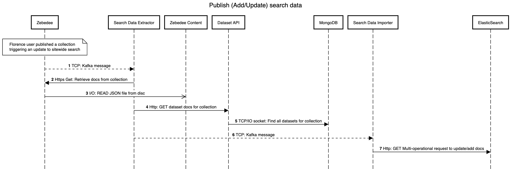
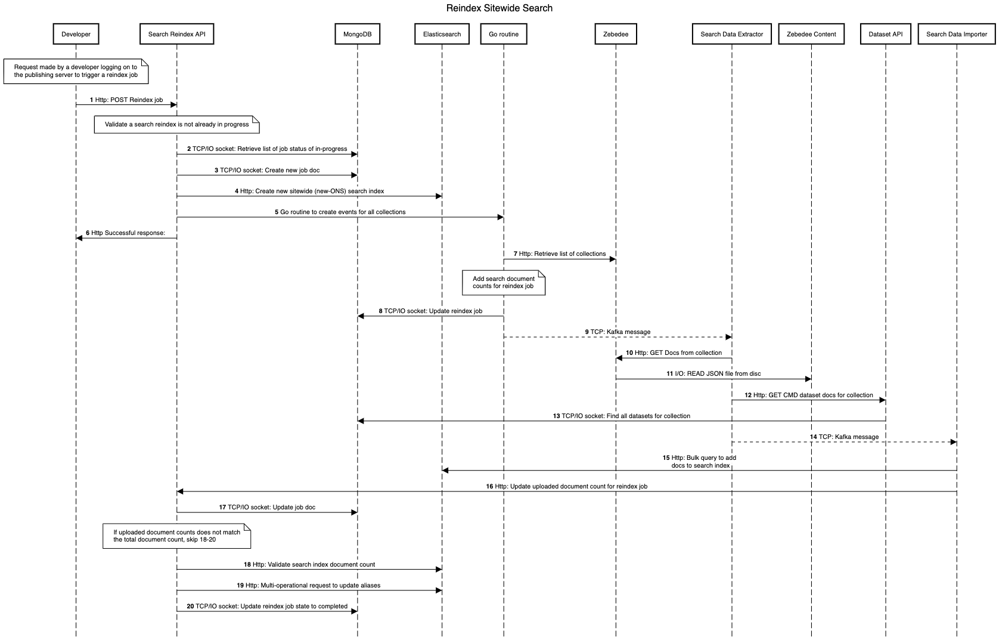

# search-architecture

Source of truth for backend processing of search data for ONS sitewide search.

## Sequence Diagrams

The source script for the each diagram is maintained in sequence folder.

To update a diagram:
- Copy the source script into [sequencediagram.org](http://sequencediagram.org)
- Update a diagram as required
- Export as an image on [sequencediagram.org](http://sequencediagram.org)
- Copy the updated source script back into `sequence/<name>.txt` and commit.

### Add/update search documents when a collection is published



#### Steps

Pre-requisite steps to publishing data not in this workflow as we will not be changing that part of the process. The following steps follow
on from a florence (DP internal user) publishes a collection that can contain 1 to many ons webpages or datasets by making a request to zebedee
which does he publishing of new webpages or updates to existing pages and lastly triggering updates to sitewide search; which is where the flow begins.

**1: Kafka messages**

On publishing a collection, write kafka message

```
Datastore: kafka

Topic: search-data-extraction
Record: {
    "job_id": string, // Empty
    "collection_id": string,
    "search_index": string // Use alias, `ONS`
}
```

**2: Retrieve docs for collection**

Consume kafka message in 1 and request Collection docs from Zebedee API endpoint.

**3: Read JSON file from disc**

Retrieve a list of documents for a specific collection from zebedee content (files on disc)

**4: Get dataset docs for collection**

This could be in parallel with 2 to increase performance.

```
Method: GET
Path: /datasets?collection_id=<collection id>
```

*Note: Dataset API needs to be extended to handle query parameter*

**5: Find all datasets for collection**

Call mongoDB with Find query include filter on collection id

**6: Kafka messages**

For each data type send a message to kafka topic 

```
Datastore: kafka

Topic: search-data-import
Record: {
    "data_type": string,
    "job_id": string, // empty
    "search_index": string, // Should use search alias ONS
    "cdid": string,
    "dataset_id": string,
    "description": string,
    "edition:: string,
    "keywords": string,
    "meta_description": string,
    "release_date": string // date format: ISO8601 or strict_date_optional_time||epoch_millis to match existing docs in search?
    "summary": string,
    "title": string,
    ... other fields we decide need to be in search
}
```

**7: Get Multi-operational request to update/add docs**

Documents received via consumption of kafka topic `search-data-import`, store documents in memory until 500 messages consumed or time from first 
message exceeded 5 seconds before making bulk request. 5 second limit will allow for the last set of messages to still be reindexed.

```
Datastore: elasticsearch
Index: ONS

Method: POST
Header: 'Content-Type: application/json'
Path: /_bulk
Body: { "update": { <search doc - Depends on data type>, "_index": "ONS" } }
```

The search document should set an `_id` field that matches the unique identifier for that document, either uuid or compound identifier (multiple fields to represent a documents uniqueness). Either way this should be determined by the data stored in Zebedee content and the dataset API.


See [Bulk API](https://www.elastic.co/guide/en/elasticsearch/reference/current/docs-bulk.html)

### Reindex



#### Steps

**1: Http POST Reindex job**

```
Path: /jobs
Path parameters: none
Header: Authorization: Bearer <token>
Body: none
```

**2: Retrieve list of in-progress jobs**

```
Datastore: mongoDB
Database: search
Collection: jobs
Filter job docs by state and time

BSON Document: {
    "state": string, // enumurated list, in-progress, failed, completed
    "reindex_started": ISODate, // ISO8601 timestamp,
    "id": string,
    ...
}
```

**Validation** - Check there are no jobs that are in-progress and created within the last hour (depends on how long a reindex takes).
If validation fails return status code 409 (conflict), message 'existing reindex job in progress'.

**3: Create new job doc in mongoDB**

```
Datastore: mongoDB
Database: search
Collection: jobs

BSON Document: {
    "id": string, // Generated unique id
    "last_updated": ISODate, // ISO8601 timestamp
    "links" : {
        "self" : string, // format: http://localhost:<PORT>/jobs/<id>
        "tasks": string, // format: http://localhost:<PORT>/jobs/<id>/tasks
    },
    "reindex_completed": ISODate, // Empty
    "reindex_failed": ISODate, // Empty
    "reindex_started": ISODate, // ISO8601 timestamp
    "search_index_name": string, // format: {ONS-<ISO8601 timestamp>}
    "state": string // set to in-progress
}
```

**4: Create new sitewide search index via Search API**

Call search API to create new index.

```
Method: POST
Path: /search
```

Response must include the search index name.

**5: Create new sitewide search index (new-ONS)**

Call elasticsearch cluster to create new index.

```
Index: ONS-<ISO8601 timestamp>
```

**6: Update job document with search_index_name**

```
Datastore: mongoDB
Database: search
Collection: jobs
Query Method: Upsert

BSON Document: {
    "last_updated": ISODate, // ISO8601 timestamp
    "search_index_name": string // format: {ONS-<ISO8601 timestamp>}
}
```

**7: Send kafka messages**

Send a message to kafka topic

```
Datastore: kafka

Topic: search-data-extraction
Record: {
    "job_id": string,
    "collection_id": string, // Empty
    "search_index": string
}
```

**8: Successful response**

```
Status Code: 201
Body: {
    "id": string, // unique id for job
    "last_updated": ISODate, // ISO8601 timestamp
    "links" : {
        "self" : string // format: http://localhost:<PORT>/jobs/<id>
        "tasks": string // format: http://localhost:<PORT>/jobs/<id>/tasks
    },
    "reindex_started": ISODate, // ISO8601 timestamp
    "search_index_name": string, // format: {ONS-<ISO8601 timestamp>}
    "state": string // set to in-progress
    "total_search_documents": integer
}
```

**9: Update Reindex job - number_of_tasks**

```
Method: PUT
Path: /jobs/{id}/number_of_tasks/{count}
```

**10: Update job doc in mongoDB with number_of_tasks**

```
Datastore: mongoDB
Database: search
Collection: jobs

BSON Document: {
    "number_of_tasks": integer
}
```

**11: Trigger extraction of search docs**

Trigger Zebedee to retrieve all searchable documents via it's API, it should extract the data from master folder as we are only interested in published data.

```
API: Zebedee

Method: POST
Path: /search-content/reindex
```

**12: Read JSON files from disc**

Read `data.json` files under master directory.

**13: Create Zebedee Task for reindex job**

Create zebedee task

```
API: Search Reindex

Method: POST
Path: /jobs/{id}/tasks/{task}
Body: {"number_of_documents": integer}
```

where `task` is set to zebedee.

```
Status Code: 201
Body: {
    "job_id": string,
    "last_updated": ISODate, // ISO8601 timestamp
    "links" : {
        "self" : string // format: http://localhost:<PORT>/jobs/<job_id>/tasks/
        "job": string // format: http://localhost:<PORT>/jobs/<job_id>/tasks/<task>
    },
    "number_of_documents": integer,
    "task": string // the API the task relates to, in this case zebedee
}
```

**14: Create Zebedee task in datastore**

Zebedee task created with number_of_documents set.

```
Datastore: mongoDB
Database: search
Collection: tasks
Document Identifier: `job_id` and `task` fields

BSON Document create: {
    "job_id": string,
    "last_updated": ISODate, // ISO8601 timestamp
    "links" : {
        "self" : string // format: http://localhost:<PORT>/jobs/<job_id>/tasks/
        "job": string // format: http://localhost:<PORT>/jobs/<job_id>/tasks/<task>
    },
    "number_of_documents": integer,
    "task": string // the API the task relates to, in this case zebedee
}
```

Also update the reindex job, add the `number_of_documents`
for Zebedee task to the existing `total_search_documents` count.

```
Datastore: mongoDB
Database: search
Collection: jobs
Document Identifier (id): job_id

BSON Document update: {
    "last_updated": ISODate, // ISO8601 timestamp
    "total_search_documents": integer
}
```

**15: Send Kafka messages**

For each data type stored against Zebedee send a message to kafka topic.

```
Datastore: kafka

Topic: search-data-import
Record: {
    "data_type": string,
    "job_id": string,
    "search_index": string,
    "cdid": string,
    "dataset_id": string,
    "description": string,
    "edition": string,
    "keywords": string,
    "meta_description": string,
    "release_date": string // date format: ISO8601 or strict_date_optional_time||epoch_millis to match existing docs in search?
    "summary": string,
    "title": string,
    ... other fields we decide need to be in search
}
```

**16: Retrieve list of datasets from Dataset API**

Call Dataset API to retrieve a count of the number of (cmd) datasets as well as a list of datasets.

```
Method: GET
Path: /datasets?state=published
```

**17: Create Dataset API Task for reindex job**

Create Dataset API task

```
API: Search Reindex

Method: POST
Path: /jobs/{id}/tasks/{task}
Body: {"number_of_documents": integer}
```

where `task` is set to dataset-api.

```
Status Code: 201
Body: {
    "job_id": string,
    "last_updated": ISODate, // ISO8601 timestamp
    "links" : {
        "self" : string // format: http://localhost:<PORT>/jobs/<job_id>/tasks/
        "job": string // format: http://localhost:<PORT>/jobs/<job_id>/tasks/<task>
    },
    "number_of_documents": integer,
    "task": string // the API the task relates to, in this case dataset-api
}
```

**18: Create Dataset API task in datastore**

Dataset API task created with number_of_documents set.

```
Datastore: mongoDB
Database: search
Collection: tasks
Document Identifier: `job_id` and `task` fields

BSON Document create: {
    "job_id": string,
    "last_updated": ISODate, // ISO8601 timestamp
    "links" : {
        "self" : string // format: http://localhost:<PORT>/jobs/<job_id>/tasks/
        "job": string // format: http://localhost:<PORT>/jobs/<job_id>/tasks/<task>
    },
    "number_of_documents": integer,
    "task": string // the API the task relates to, in this case zebedee
}
```

Also update the reindex job, add the `number_of_documents`
for dataset API task to the existing `total_search_documents` count.

```
Datastore: mongoDB
Database: search
Collection: jobs
Document Identifier (id): job_id

BSON Document update: {
    "last_updated": ISODate, // ISO8601 timestamp
    "total_search_documents": integer
}
```

**19: Send Kafka messages**

For each dataset doc send a message to kafka topic 

```
Datastore: kafka

Topic: search-data-import
Record: {
    "data_type": string,
    "job_id": string,
    "search_index": string,
    "cdid": string,
    "dataset_id": string,
    "description": string,
    "edition": string,
    "keywords": string,
    "meta_description": string,
    "release_date": string // date format: ISO8601 or strict_date_optional_time||epoch_millis to match existing docs in search?
    "summary": string,
    "title": string,
    ... other fields we decide need to be in search
}
```

**20: Bulk query to add docs to search index**

Documents received via consumption of kafka topic `search-data-import`, store documents in memory until 500 messages consumed or time from first 
message exceeded 5 seconds before making bulk request. 5 second limit will allow for the last set of messages to still be reindexed.

```
Datastore: elasticsearch
Index: search_index

Method: POST
Path: /_bulk
Body: Depends on data type
```

See [Bulk API](https://www.elastic.co/guide/en/elasticsearch/reference/current/docs-bulk.html)

Extension to handle failure scenarios:

If bulk request fails then we should requeue events consumed with an additional attempts field. Once an event has failed more than 3 attempts, we should send request to reindex API to update state to failed and not requeue event. (Design needs to be thought through - should we be using a new kafka topic to handle these events?)

**21: Update uploaded document count for reindex job**

```
Method: PUT 
Path: /jobs/{id}/inserted-documents/{count}
```

**22: Update job doc**

```
Datastore: mongoDB
Database: search
Collection: jobs
Document Identifier (id): job.id

BSON Document update: {
    "last_updated": ISODate, // ISO8601 timestamp
    "total_inserted_search_documents": integer
}
```

*Note: When updating the count, this should be adding to the current value*

Check counts match: `"total_inserted_search_documents" is equal to "total_search_documents"` and `number_of_tasks` is equal to the number of tasks returned requesting a list of tasks for particular job id in datastore

**23: POST ONS alias to search index**

Call elasticsearch to check the index count matches the `total_search_documents` value.

```
Datastore: elasticsearch

Method: POST
Path: /search/{index}/alias
```

**24: Validate search index document count**

Call elasticsearch to check the index count matches the `total_search_documents` value.

```
Datastore: elasticsearch

Method: GET
Path: /{index}/_count
```

Wait before making a new request (attempt) to a maximum of 3?

**25: Multi-operational request to update aliases**

See [index alias API](https://www.elastic.co/guide/en/elasticsearch/reference/current/indices-aliases.html) to see how this is done

```
Datastore: elasticsearch

Method: POST
Path: /_aliases
Body: {
    "actions" : [
    {"remove": {"index" : "<new-index>", "alias" : "new-ONS"}},
    {"remove": {"index" : "<old-index>", "alias" : "ONS"}},
    {"add" : {"index" : "<new-index>", "alias" : "ONS" }},
    {"remove-index" : {"index" : "<old-index>"}},
  ]
}
```

Note: alias `new-ONS` may not be needed in performing a reindex, it may just be less cumbersome and more obvious to a developer to use
new-ONS and ONS to refer to the new index and an existing index respectively instead of the index name (e.g. comparing 2 ONS-<datetime> values).

**26: Update Reindex job state to completed**

```
Datastore: mongoDB
Database: search
Collection: jobs
Document Identifier (id): job.id

BSON Document update: {
    "last_updated": ISODate, // ISO8601 timestamp
    "reindex_completed": ISODate,
    "state": "completed"
}
```

**Note**

If the reindex job fails, we should be updating the job document accordingly with a `"reindex_failed": ISODate, "state": "failed"`.

Use the following PUT endpoint on Search Reindex API:

Update Reindex Job state to failed

```
API: Search Reindex

Method: PUT
Path: /jobs/{id}/state/{state} // where state is set to "failed"
```

Search Reindex API -> datastore

```
Datastore: mongoDB
Database: search
Collection: jobs
Document Identifier (id): job.id

BSON Document update: {
    "last_updated": ISODate, // ISO8601 timestamp
    "reindex_failed": ISODate,
    "state": "failed"
}
```